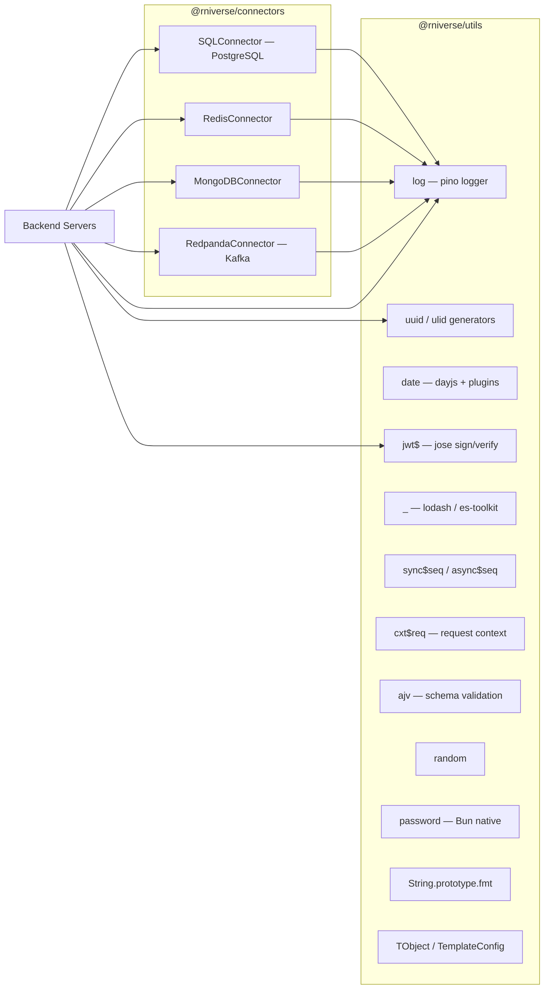

# Understanding `@rniverse/connectors` & `@rniverse/utils`

A comprehensive analysis of both repositories that power the rniverse backend infrastructure.

---

## Relationship Between Repos



> [!IMPORTANT]
> `connectors` declares `@rniverse/utils` as a **peer dependency** (`github:rniverse/utils#dist`). Both repos target **Bun runtime** and use **ESNext** module format.

---

## `@rniverse/utils` — Shared Utility Library

| Module | Export | What it does |
|--------|--------|-------------|
| [logger.ts](file:///Users/rrkjonnapalli/works/rniverse/utils/lib/utils/logger.ts) | `log`, [createLogger](file:///Users/rrkjonnapalli/works/rniverse/utils/lib/utils/logger.ts#31-55) | Pino logger with pretty-print, auto-injects `req_id` and `user_id` from `AsyncLocalStorage` |
| [id.ts](file:///Users/rrkjonnapalli/works/rniverse/utils/lib/utils/id.ts) | `uuid`, `ulid` | UUID v7 (via `bun.randomUUIDv7`) and ULID generation with time extraction |
| [datetime.ts](file:///Users/rrkjonnapalli/works/rniverse/utils/lib/utils/datetime.ts) | [date](file:///Users/rrkjonnapalli/works/rniverse/connectors/lib/core/mongodb.connector.ts#156-170) | Dayjs with **25+ plugins** (timezone, duration, relative time, isBetween, etc.) |
| [jose.ts](file:///Users/rrkjonnapalli/works/rniverse/utils/lib/utils/jose.ts) | `jwt$`, [sign](file:///Users/rrkjonnapalli/works/rniverse/utils/lib/utils/jose.ts#53-73), [verify](file:///Users/rrkjonnapalli/works/rniverse/utils/lib/utils/jose.ts#23-52), `jose` | JWT sign/verify via jose, HS256 default, configurable issuer/audience/expiry |
| [lodash.ts](file:///Users/rrkjonnapalli/works/rniverse/utils/lib/utils/lodash.ts) | `_`, [cleanup](file:///Users/rrkjonnapalli/works/rniverse/utils/lib/utils/lodash.ts#6-26), [pickOne](file:///Users/rrkjonnapalli/works/rniverse/utils/lib/utils/lodash.ts#27-44), [templated](file:///Users/rrkjonnapalli/works/rniverse/utils/lib/utils/lodash.ts#45-70), [titleCase](file:///Users/rrkjonnapalli/works/rniverse/utils/lib/utils/lodash.ts#71-74) | es-toolkit + compat get/set/has + custom [cleanup](file:///Users/rrkjonnapalli/works/rniverse/utils/lib/utils/lodash.ts#6-26) (deep nil removal), [pickOne](file:///Users/rrkjonnapalli/works/rniverse/utils/lib/utils/lodash.ts#27-44) (first non-nil from paths), [templated](file:///Users/rrkjonnapalli/works/rniverse/utils/lib/utils/lodash.ts#45-70) (declarative object mapping) |
| [seq.ts](file:///Users/rrkjonnapalli/works/rniverse/utils/lib/utils/seq.ts) | `sync$seq`, `async$seq` | Sequential code/ID generators — sync for startup, async with concurrency-safe locking |
| [req.context.ts](file:///Users/rrkjonnapalli/works/rniverse/utils/lib/utils/context/req.context.ts) | `cxt$req`, [RequestContext](file:///Users/rrkjonnapalli/works/rniverse/utils/lib/utils/context/req.context.ts#10-59) | `AsyncLocalStorage`-based request context — stores `requestId`, `userId`, arbitrary keys |
| [ajv.ts](file:///Users/rrkjonnapalli/works/rniverse/utils/lib/utils/ajv.ts) | `ajv` | Pre-configured Ajv instance with keywords + formats plugins |
| [random.ts](file:///Users/rrkjonnapalli/works/rniverse/utils/lib/utils/random.ts) | `random` | `random.int()` and `random.float()` helpers |
| [password.ts](file:///Users/rrkjonnapalli/works/rniverse/utils/lib/utils/password.ts) | `password` | Re-exports Bun's native `password` (hash/verify) |
| [string.patch.ts](file:///Users/rrkjonnapalli/works/rniverse/utils/lib/patch/string.patch.ts) | `String.prototype.fmt` | Template formatting patch — `"Hello {name}".fmt({ name: "World" })` with case-insensitive matching |
| Re-exports | `bullmq`, `commander`, `undici`, `valibot`, `zlib` | Thin re-exports of peer/deps for centralized access |

### Type System

| Type | Purpose |
|------|---------|
| [TObject](file:///Users/rrkjonnapalli/works/rniverse/utils/lib/type/object.type.ts#1-11) | Recursive object type allowing nested objects, arrays, primitives, null, undefined |
| [TNObject](file:///Users/rrkjonnapalli/works/rniverse/utils/lib/type/object.type.ts#12-15) | Same as [TObject](file:///Users/rrkjonnapalli/works/rniverse/utils/lib/type/object.type.ts#1-11) but **non-nullable** (no null/undefined) |
| [TemplateConfig](file:///Users/rrkjonnapalli/works/rniverse/utils/lib/type/lodash.type.ts#1-7) | Config for [templated()](file:///Users/rrkjonnapalli/works/rniverse/utils/lib/utils/lodash.ts#45-70) — `hardcode`, `getters[]`, `now`, `default` |

### Test Coverage

82 tests, 100% passing. Covers: `string.patch`, `req.context`, `lodash.cleanup`, `lodash.pickOne`, `lodash.templated`, `id`, `jwt`, `logger`, `seq`, `datetime`.

---

## `@rniverse/connectors` — Database & Messaging Connectors

All connectors follow **the same lifecycle pattern**:

```
new Connector(config) → await connector.connect() → use → await connector.close()
```

- [connect()](file:///Users/rrkjonnapalli/works/rniverse/connectors/lib/core/sql.connector.ts#16-27) is **idempotent** — stores the init promise, retries on failure
- [require_client()](file:///Users/rrkjonnapalli/works/rniverse/connectors/lib/core/redis.connector.ts#40-44) guards throw if called before [connect()](file:///Users/rrkjonnapalli/works/rniverse/connectors/lib/core/sql.connector.ts#16-27)
- All operations return a **Result pattern**: `{ ok: true, data }` or `{ ok: false, error }`
- All failures are logged via `@rniverse/utils` logger

### Connector Details

#### [SQLConnector](file:///Users/rrkjonnapalli/works/rniverse/connectors/lib/core/sql.connector.ts) — PostgreSQL via Drizzle ORM

- **Tool**: [drizzle.tool.ts](file:///Users/rrkjonnapalli/works/rniverse/connectors/lib/tools/drizzle.tool.ts) — wraps `bun:SQL` + `drizzle-orm/bun-sql`
- **Config**: URL string or host/port/database/user/password + pool options
- **Pool defaults**: max=20, idleTimeout=30s, maxLifetime=3600s, connectionTimeout=30s
- **Connect check**: `SELECT 1`
- **API**: [getInstance()](file:///Users/rrkjonnapalli/works/rniverse/connectors/lib/core/sql.connector.ts#60-63) returns Drizzle ORM instance; also exposes `$client` for raw tagged SQL

#### [RedisConnector](file:///Users/rrkjonnapalli/works/rniverse/connectors/lib/core/redis.connector.ts)

- **Tool**: [redis.tool.ts](file:///Users/rrkjonnapalli/works/rniverse/connectors/lib/tools/redis.tool.ts) — wraps `bun:RedisClient`
- **Config**: URL + connection options (TLS, auto-reconnect, pipelining)
- **Defaults**: connectionTimeout=10s, idleTimeout=30s, autoReconnect=true, maxRetries=10, autoPipelining=true
- **Connect check**: `PING`
- **API**: [getInstance()](file:///Users/rrkjonnapalli/works/rniverse/connectors/lib/core/sql.connector.ts#60-63) returns raw Bun `RedisClient`

#### [MongoDBConnector](file:///Users/rrkjonnapalli/works/rniverse/connectors/lib/core/mongodb.connector.ts) — Most feature-rich

- **Tool**: [mongodb.tool.ts](file:///Users/rrkjonnapalli/works/rniverse/connectors/lib/tools/mongodb.tool.ts) — wraps `mongodb.MongoClient`
- **Config**: URL + optional database name + pool/timeout options
- **Pool defaults**: maxPoolSize=10, minPoolSize=2, connectTimeout=10s, socketTimeout=45s
- **Connect check**: [admin().ping()](file:///Users/rrkjonnapalli/works/rniverse/connectors/lib/core/redpanda.connector.ts#48-59)
- **Full CRUD API**: [findOne](file:///Users/rrkjonnapalli/works/rniverse/connectors/lib/core/mongodb.connector.ts#96-111), [find](file:///Users/rrkjonnapalli/works/rniverse/connectors/lib/core/mongodb.connector.ts#112-126), [insertOne](file:///Users/rrkjonnapalli/works/rniverse/connectors/lib/core/mongodb.connector.ts#127-140), [insertMany](file:///Users/rrkjonnapalli/works/rniverse/connectors/lib/core/mongodb.connector.ts#141-155), [updateOne](file:///Users/rrkjonnapalli/works/rniverse/connectors/lib/core/mongodb.connector.ts#156-170), [updateMany](file:///Users/rrkjonnapalli/works/rniverse/connectors/lib/core/mongodb.connector.ts#171-185), [deleteOne](file:///Users/rrkjonnapalli/works/rniverse/connectors/lib/core/mongodb.connector.ts#186-199), [deleteMany](file:///Users/rrkjonnapalli/works/rniverse/connectors/lib/core/mongodb.connector.ts#200-213)
- **Plus**: [aggregate](file:///Users/rrkjonnapalli/works/rniverse/connectors/lib/core/mongodb.connector.ts#228-241), [countDocuments](file:///Users/rrkjonnapalli/works/rniverse/connectors/lib/core/mongodb.connector.ts#214-227), [createIndex](file:///Users/rrkjonnapalli/works/rniverse/connectors/lib/core/mongodb.connector.ts#242-256), [listCollections](file:///Users/rrkjonnapalli/works/rniverse/connectors/lib/core/mongodb.connector.ts#257-267), [dropCollection](file:///Users/rrkjonnapalli/works/rniverse/connectors/lib/core/mongodb.connector.ts#268-279)
- **Multi-DB**: [getDB(name)](file:///Users/rrkjonnapalli/works/rniverse/connectors/lib/core/mongodb.connector.ts#84-87) and [getCollection(name, { db })](file:///Users/rrkjonnapalli/works/rniverse/connectors/lib/core/mongodb.connector.ts#88-95) for cross-database ops

#### [RedpandaConnector](file:///Users/rrkjonnapalli/works/rniverse/connectors/lib/core/redpanda.connector.ts) — Kafka-compatible

- **Tool**: [redpanda.tool.ts](file:///Users/rrkjonnapalli/works/rniverse/connectors/lib/tools/redpanda.tool.ts) — wraps `kafkajs.Kafka`
- **Config**: Brokers array or URL string, clientId, SSL/SASL, timeout options
- **Manages 3 sub-clients independently**: Admin, Producer, Consumer (each lazy-initialized)
- **Admin API**: [createTopic](file:///Users/rrkjonnapalli/works/rniverse/connectors/lib/core/redpanda.connector.ts#128-148), [listTopics](file:///Users/rrkjonnapalli/works/rniverse/connectors/lib/core/redpanda.connector.ts#149-159), [deleteTopic](file:///Users/rrkjonnapalli/works/rniverse/connectors/lib/core/redpanda.connector.ts#160-171), [fetchTopicMetadata](file:///Users/rrkjonnapalli/works/rniverse/connectors/lib/core/redpanda.connector.ts#172-184)
- **Producer API**: [publish({ topic, messages })](file:///Users/rrkjonnapalli/works/rniverse/connectors/lib/core/redpanda.connector.ts#185-203)
- **Consumer API**: [subscribe({ topics, groupId, fromBeginning }, handler)](file:///Users/rrkjonnapalli/works/rniverse/connectors/lib/core/redpanda.connector.ts#204-237), [unsubscribe()](file:///Users/rrkjonnapalli/works/rniverse/connectors/lib/core/redpanda.connector.ts#238-248)
- **Constraint**: Only one consumer group at a time per connector instance
- **Close**: Disconnects all 3 sub-clients in parallel

### Architecture

```
lib/
├── core/     # Connector classes (high-level API)
│   ├── mongodb.connector.ts
│   ├── redis.connector.ts
│   ├── redpanda.connector.ts
│   └── sql.connector.ts
├── tools/    # Low-level factory functions (init* helpers)
│   ├── drizzle.tool.ts
│   ├── mongodb.tool.ts
│   ├── redis.tool.ts
│   └── redpanda.tool.ts
├── types/    # TypeScript config interfaces per connector
└── migrations/  # Drizzle migration samples
```

### Path Aliases (tsconfig)

| Alias | Points to |
|-------|-----------|
| `@tools` / `@tools/*` | `lib/tools` |
| `@type` / `@type/*` | `lib/types` |
| `@core` / `@core/*` | `lib/core` |
| `@migrations` / `@migrations/*` | `lib/migrations` |

---

## Key Design Patterns Across Both Repos

1. **Result Pattern** — MongoDB ops and Redpanda admin/publish return `{ ok: true, data }` | `{ ok: false, error }` instead of throwing
2. **Idempotent connect** — All connectors cache the init promise, safe to call `connect()` multiple times
3. **Retry on failure** — Init promise is nulled on error so next `connect()` retries
4. **Structured logging** — All connectors log via the shared `@rniverse/utils` logger with request context
5. **Namespace exports** — Utils uses `$` naming (`jwt$`, `cxt$req`, `sync$seq`, `async$seq`) for namespaced objects
6. **Bun-native** — Redis and SQL use Bun built-in APIs (`bun:SQL`, `bun:RedisClient`); password hashing via `bun.password`
7. **Peer dependencies** — Heavy libs (drizzle, kafkajs, mongodb, pino, bullmq) are peer deps to avoid duplication
